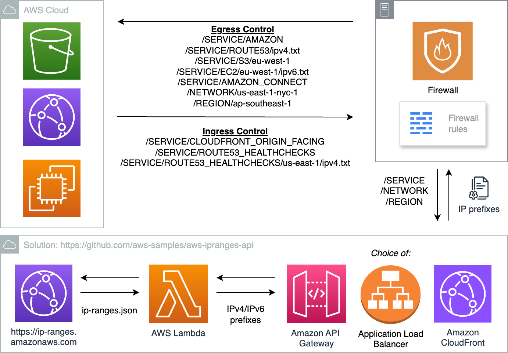

## AWS-IPRanges-API

[Serverless](https://aws.amazon.com/serverless/) web site based on [Amazon API Gateway](https://aws.amazon.com/api-gateway/) and [AWS Lambda](https://aws.amazon.com/lambda/) that outputs IP prefixes from AWS ip-ranges.json as web feeds for use by firewalls and other applications. Also allows IP address lookup of corresponding Region, service and network border group. 


## Description
AWS [publishes](https://docs.aws.amazon.com/general/latest/gr/aws-ip-ranges.html) its IP ranges in json format through [ip-ranges.json](https://ip-ranges.amazonaws.com/ip-ranges.json). The IP prefixes are commonly used by network firewalls for inbound and/or outbound network access control. 

A common use case is [Amazon CloudFront](https://aws.amazon.com/cloudfront/) with on-premise web server as origin; only [CloudFront origin facing](https://docs.aws.amazon.com/AmazonCloudFront/latest/DeveloperGuide/LocationsOfEdgeServers.html) (and if in use [Route 53 Health Checks](https://docs.aws.amazon.com/Route53/latest/DeveloperGuide/route-53-ip-addresses.html)) IP prefixes are allowed inbound access at perimeter network firewall. 

Another use case is for [egress control](https://docs.aws.amazon.com/general/latest/gr/aws-ip-ranges.html#aws-ip-egress-control) where firewall administrators allow-list or deny-list outbound network acess to all or specific AWS service or Region such as [Route 53 name servers](https://docs.aws.amazon.com/Route53/latest/DeveloperGuide/route-53-ip-addresses.html) or [Amazon S3](https://aws.amazon.com/premiumsupport/knowledge-center/s3-find-ip-address-ranges/)

Typically, the firewall administrator will extract out required IP prefixes from ip-ranges.json for use in firewall rules. The IP prefixes need to be updated whenever there are changes and users can subscribe to [AWS IP address ranges notifications](https://docs.aws.amazon.com/general/latest/gr/aws-ip-ranges.html#subscribe-notifications)

This project makes IP prefixes available as web feeds for automatic updates by firewalls. Users have the option to filter IP prefixes by service, Region and network border group, and in combined IPv4 and IPv6, IPv4 only or IPv6 only format. Entire solution is serverless and can be deployed via a single CloudFormation file. 

Solution is mentioned in blog post [How to enhance CloudFront origin security of on-premise web servers using third-party firewalls](https://aws.amazon.com/blogs/networking-and-content-delivery/how-to-enhance-cloudfront-origin-security-of-on-premise-web-servers-using-third-party-firewalls/)

## Architecture Diagram



## Deployment via CloudFormation console
Download [`template.yaml`](https://raw.githubusercontent.com/aws-samples/aws-ipranges-api/main/template.yaml) file and login to AWS [CloudFormation console](https://console.aws.amazon.com/cloudformation/home#/stacks/create/template). Choose **Create Stack**, **Upload a template file**, **Choose File**, select `template.yaml` and choose **Next**.

Specify a **Stack name** and adjust parameters values as desired. Parameters options include
- `allowNetworks`: Source IP prefixes that are authorized to use API Gateway separated by commas. Default is **0.0.0.0/0**
- `awsServices`: Name of AWS services to return by root URL separated by commas. Default is **CLOUDFRONT_ORIGIN_FACING**
- `cpuArchitecture`: Instruction set architecture (x86_64 or arm64). Default is **arm64**
- `lambdaFunctionName`: Lambda function name. Default is **aws-ipranges-api**
- `lambdaAuthorizerFunctionName`: Lambda authorizer function name. Default is **aws-ipranges-api-authorizer**
- `pythonRuntime`: Python 3 runtime version. Default is **python3.12**

Continue **Next** with [Configure stack options](https://docs.aws.amazon.com/AWSCloudFormation/latest/UserGuide/cfn-console-add-tags.html), [Review](https://docs.aws.amazon.com/AWSCloudFormation/latest/UserGuide/cfn-using-console-create-stack-review.html) settings, and click **Create Stack** to launch your stack. 

After stack has been successfully created, its status changes to **CREATE_COMPLETE**. Go to **Outputs** tab to get `apiGatewayInvokeURL` value (in the format `https://<api-id>.execute-api.<region>.amazonaws.com`) for use by firewall. Refer to [Output options](#output-options) below for more details.

  
## Firewall Setup
Firewalls that support external intel/threat feed for IP prefixes updates include (but not limited to)
- Fortinet: [External Block List](https://docs.fortinet.com/document/fortigate/7.0.5/administration-guide/891236/external-blocklist-policy)
- Palo Alto Networks: [External Dynamic List](https://docs.paloaltonetworks.com/pan-os/10-1/pan-os-admin/policy/use-an-external-dynamic-list-in-policy/configure-the-firewall-to-access-an-external-dynamic-list.html) 
- OPNsense: [URL Tables (IPs) Aliases](https://docs.opnsense.org/manual/aliases.html)
- pfSense: [URL Table Aliases](https://docs.netgate.com/pfsense/en/latest/firewall/aliases.html#url-table-aliases)

Refer to vendor website documentation for configuration steps.
[AWS Network Firewall](https://aws.amazon.com/network-firewall/) users can check [Automated Network Firewall Rules for CloudFront IP Ranges](https://github.com/aws-samples/automated-network-firewall-rules-for-cloudfront-ip-ranges) project while Check Point users have access to AWS IP prefixes from [Updatable Objects](https://supportcenter.checkpoint.com/supportcenter/portal?eventSubmit_doGoviewsolutiondetails=&solutionid=sk131852) 

## Output options
Use different URLs to return IP prefixes and other values. Example
  - `/` : return CloudFront origin facing prefixes, customizable via `awsServices` in CloudFormation template and Lambda function `SERVICES` environment variable
  - `/SERVICE` : listing of available services
  - `/REGION` : listing of available Regions
  - `/NETWORK` : listing of network border groups which are a unique set of Availability Zones or [Local Zones](https://aws.amazon.com/about-aws/global-infrastructure/localzones/) from where AWS advertises IP addresses
  - `/SERVICE/<SERVICE>` : prefixes for specific SERVICE, e.g. `/SERVICE/CLOUDFRONT_ORIGIN_FACING`
  - `/SERVICE/<SERVICE>/<REGION>` : prefixes for specific SERVICE and REGION, e.g. `/SERVICE/EC2/us-east-1`
  - `/REGION/<REGION>` : prefixes for specific REGION, e.g. `/REGION/ap-southeast-1`
  - `/NETWORK/<NETWORK>` : prefixes for specific network border group, e.g. `/NETWORK/us-east-1-nyc-1`
  - `/SEARCH/<IP ADDRESS>`: IPv4 or IPv6 address to query, e.g. `/SEARCH/13.34.96.200`. This will return any matching entries, e.g.
    ```
    ip_prefix,region,service,network_border_group
    13.34.96.224/27,ap-southeast-1,AMAZON,ap-southeast-1
    ```
  - `/createDate` :  ip-ranges.json publication date and time, in UTC YY-MM-DD-hh-mm-ss format
  - `/syncToken` :  ip-ranges.json publication time, in Unix epoch time format

For IP prefixes, you can append `/ipv4.txt` or `/ipv6.txt` to filter by IPv4 or IPv6 respectively, e.g. `/SERVICE/ROUTE53_HEALTHCHECKS/ipv4.txt`

## API Gateway Customisation
Refer to [Amazon API Gateway documentation](https://docs.aws.amazon.com/apigateway/latest/developerguide/welcome.html) for HTTP API customisation options. Some examples include
- [Setting up custom domain names](https://docs.aws.amazon.com/apigateway/latest/developerguide/http-api-custom-domain-names.html)
- [Configuring mutual TLS authentication](https://docs.aws.amazon.com/apigateway/latest/developerguide/http-api-mutual-tls.html)
- [Throttling requests to your HTTP API](https://docs.aws.amazon.com/apigateway/latest/developerguide/http-api-throttling.html)
- [Working with AWS Lambda authorizers for HTTP APIs](https://docs.aws.amazon.com/apigateway/latest/developerguide/http-api-lambda-authorizer.html): Lambda authorizer is used to limit access by source IP prefixes

## Security

See [CONTRIBUTING](CONTRIBUTING.md#security-issue-notifications) for more information.

## License

This library is licensed under the MIT-0 License. See the LICENSE file.

